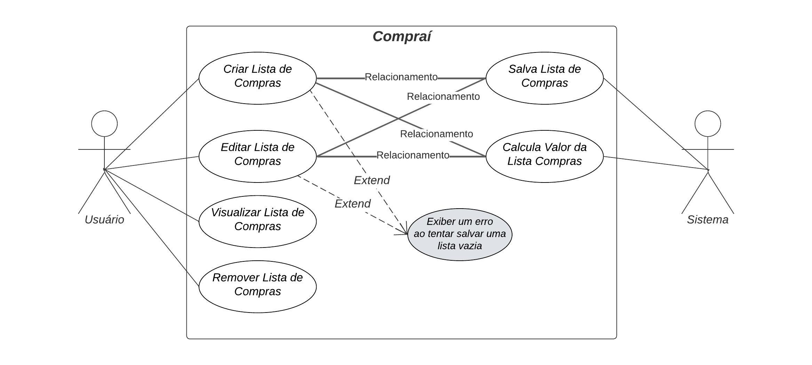

# Especificações do Projeto

A definição precisa do problema e os principais aspectos a serem abordados neste projeto foram estabelecidos por meio de um trabalho de imersão realizado pela equipe, envolvendo a observação dos usuários em seu ambiente natural e entrevistas. Os insights obtidos foram sintetizados em personas e histórias de usuários para orientar o desenvolvimento do projeto.

## Personas

As personas levantadas durante o processo de entendimento do problema são apresentadas na Figuras que se seguem.

<h3>Persona 1</h3>

<table>
      <tr>
        <td>Nome/Idade</td>
        <td>Jorge - 22 anos</td>
      </tr>
      <tr>
        <td>Profissão</td>
        <td>Universitário</td>
      </tr>
      <tr>
        <td>História</td>
        <td>Jorge é um estudante universitário que mora sozinho. Ele não tem muita experiência com compras e muitas vezes se esquece de comprar itens essenciais.</td>
      </tr>
      <tr>
        <td>Motivação</td>
        <td>Lembrar o que precisa comprar e manter o controle de seus gastos com alimentos.</td>
      </tr>
      <tr>
        <td>Desafio</td>
        <td>Lembrar o que precisa comprar e manter o controle de seus gastos com alimentos.</td>
      </tr>
      <tr>
        <td>Ferramenta em uso atualmente: </td>
        <td>Aplicativo de notas no celular </td>
      </tr>
</table>

<h3>Persona 2</h3>

<table>
      <tr>
        <td>Nome/Idade</td>
        <td>Júlia - 26 anos</td>
      </tr>
      <tr>
        <td>Profissão</td>
        <td>Nutricionista</td>
      </tr>
      <tr>
        <td>História</td>
        <td>Julia está sempre procurando maneiras de ajudar seus clientes a manter uma dieta saudável. Ela acredita que uma boa alimentação começa com uma boa compra de supermercado.</td>
      </tr>
      <tr>
        <td>Motivação</td>
        <td>Ajudar seus clientes a manterem uma alimentação balanceada.</td>
      </tr>
      <tr>
        <td>Desafio</td>
        <td>Planejar e organizar as compras de supermercado mais saudável para seus clientes.</td>
      </tr>
      <tr>
        <td>Ferramenta em uso atualmente: </td>
        <td>Planilhas de controle de dieta </td>
      </tr>
</table>

<h3>Prsona 3</h3>

<table>
      <tr>
        <td>Nome/Idade</td>
        <td>Dona Ana - 64 anos</td>
      </tr>
      <tr>
        <td>Profissão</td>
        <td>Aposentada</td>
      </tr>
      <tr>
        <td>História</td>
        <td>Ana gosta de cozinhar para sua família e amigos. Ela faz compras semanalmente e está sempre procurando novas receitas para experimentar.</td>
      </tr>
      <tr>
        <td>Motivação</td>
        <td>Experimentar novas receitas e manter o controle de seu orçamento.</td>
      </tr>
      <tr>
        <td>Desafio</td>
        <td>Planejar suas compras de acordo com as receitas que deseja experimentar.</td>
      </tr>
      <tr>
        <td>Ferramenta em uso atualmente: </td>
        <td>Lista de compras em papel.</td>
      </tr>
</table>

<h3>Prsona 4</h3>

<table>
      <tr>
        <td>Nome/Idade</td>
        <td>Maria - 42 anos</td>
      </tr>
      <tr>
        <td>Profissão</td>
        <td>Gerente Executiva</td>
      </tr>
      <tr>
        <td>História</td>
        <td>Maria está sempre ocupada entre o trabalho e cuidar de seus filhos. Ela está sempre procurando maneiras de economizar tempo.</td>
      </tr>
      <tr>
        <td>Motivação</td>
        <td>Maria perde muito tempo preparando listas de compra manuais e assim não consegue ter disponibilidade para dar mais atenção aos filhos.</td>
      </tr>
      <tr>
        <td>Desafio</td>
        <td>Organizar suas compras de supermercado de forma mais eficiente que poupasse seu tempo na hora de organizar suas compras de mercado.</td>
      </tr>
      <tr>
        <td>Ferramenta em uso atualmente: </td>
        <td>Lista de compras em papel.</td>
      </tr>
</table>

<h3>Persona 5</h3>

<table>
      <tr>
        <td>Nome/Idade</td>
        <td>Carlos - 37 anos</td>
      </tr>
      <tr>
        <td>Profissão</td>
        <td>Profissional autônomo</td>
      </tr>
      <tr>
        <td>História</td>
        <td>Carlos valoriza a flexibilidade e a eficiência em sua rotina. Ele está sempre em busca de ferramentas que possam otimizar seu tempo.</td>
      </tr>
      <tr>
        <td>Motivação</td>
        <td>Concentrar-se em seu trabalho e hobbies sem se preocupar com as compras de supermercado.</td>
      </tr>
      <tr>
        <td>Desafio</td>
        <td>Gerenciar suas compras de supermercado de forma eficiente.</td>
      </tr>
      <tr>
        <td>Ferramenta em uso atualmente: </td>
        <td>Lista de compras criada e enviado pelo Whatsapp</td>
      </tr>
</table>

## Histórias de Usuários

|EU COMO... `PERSONA`| QUERO/PRECISO ... `FUNCIONALIDADE` |PARA ... `MOTIVO/VALOR`                 |
|--------------------|------------------------------------|----------------------------------------|
|Jorge  | De lembretes do que comprar através de um aplicativo | Garantir que não me esqueça de itens essenciais                |
|Júlia| Usar um aplicativo para planejar e organizar as compras de supermercado| Garantir que eu e meus clientes mantenhamos uma alimentação balanceada |
|Dona Ana | Planejar minhas compras em um aplicativo com base nas receitas que quero experimentar | Manter o controle do meu orçamento e garantir que tenho todos os ingredientes necessários |
|Dona Ana | Aplicação deve ser de fácil uso | Experiência de uso fácil e intuitivo |
|Maria| Poder criar e organizar minha lista de compras pelo celular de maneira fácil | Economizar tempo e me concentrar mais na minha família |
|Carlos | Preciso gerenciar minhas compras de supermercado | Me concentrar em meu trabalho e hobbies. |

## Modelagem do Processo de Negócio 

### Análise da Situação Atual

Apresente aqui os problemas existentes que viabilizam sua proposta. Apresente o modelo do sistema como ele funciona hoje. Caso sua proposta seja inovadora e não existam processos claramente definidos, apresente como as tarefas que o seu sistema pretende implementar são executadas atualmente, mesmo que não se utilize tecnologia computacional. 

### Descrição Geral da Proposta

Apresente aqui uma descrição da sua proposta abordando seus limites e suas ligações com as estratégias e objetivos do negócio. Apresente aqui as oportunidades de melhorias.

### Processo 1 – NOME DO PROCESSO

Apresente aqui o nome e as oportunidades de melhorias para o processo 1. Em seguida, apresente o modelo do processo 1, descrito no padrão BPMN. 

### Processo 2 – NOME DO PROCESSO

Apresente aqui o nome e as oportunidades de melhorias para o processo 2. Em seguida, apresente o modelo do processo 2, descrito no padrão BPMN.

## Indicadores de Desempenho

Apresente aqui os principais indicadores de desempenho e algumas metas para o processo. Atenção: as informações necessárias para gerar os indicadores devem estar contempladas no diagrama de classe. Colocar no mínimo 5 indicadores. 

Usar o seguinte modelo: 

Obs.: todas as informações para gerar os indicadores devem estar no diagrama de classe a ser apresentado a posteriori. 

## Requisitos

As tabelas que se seguem apresentam os requisitos funcionais e não funcionais que detalham o escopo do projeto. Para determinar a prioridade de requisitos, aplicar uma técnica de priorização de requisitos e detalhar como a técnica foi aplicada.

### Requisitos Funcionais

|ID    | Descrição do Requisito  | Prioridade |
|------|-----------------------------------------|----|
|RF-001| O sistema deve permitir que os usuários criem uma lista de compras. | ALTA | 
|RF-002| O sistema deve permitir que os usuários adicionem itens à lista de compras.   | ALTA |
|RF-003| 	O sistema deve permitir que os usuários removam itens da lista de compras.   | ALTA |
|RF-004| 	O sistema deve permitir que os usuários marquem itens como comprados na lista de compras.  | MÉDIA |
|RF-005| 	O sistema deve calcular o total de despesas com base nos itens da lista de compras.  | ALTA |
|RF-006| O sistema deve enviar lembretes aos usuários sobre os itens que precisam ser comprados.   | BAIXA |

### Requisitos não Funcionais

|ID     | Descrição do Requisito  |Prioridade |
|-------|-------------------------|----|
|RNF-001| 	A aplicação deverá ser desenvolvida usando React Native | ALTA | 
|RNF-002| O sistema deve ser fácil de usar e intuitivo. | ALTA | 
|RNF-003| 	O sistema deve ser capaz de processar e responder às solicitações do usuário de maneira rápida e eficiente. |  ALTA |
|RNF-004| 	O sistema deve estar disponível para uso a qualquer momento e em qualquer lugar.|  MÉDIA |
|RNF-005| O sistema deve ser compatível com as plataformas iOS e Android. | MÉDIA |
|RNF-006| A aplicação deve possuir uma interface simples, apresentando as informações de forma visual e acessível | MÉDIA |

## Restrições

O projeto está restrito pelos itens apresentados na tabela a seguir.

|ID| Restrição                                             |
|--|-------------------------------------------------------|
|RE-01| 	O sistema deve ser desenvolvido e lançado dentro do prazo estabelecido para o projeto. |
|RE-02| O sistema deve suportar o português brasileiro, pois é o idioma principal dos usuários-alvo. |
|RE-03| O projeto deve ser construído apenas por pessoas da equipe. |
|RE-04| O sistema deve ser capaz de se adaptar a mudanças futuras, como a adição de novas funcionalidades ou a integração com outros sistemas. |

## Diagrama de Casos de Uso

# Matriz de Rastreabilidade

A matriz de rastreabilidade é uma ferramenta usada para facilitar a visualização dos relacionamento entre requisitos e outros artefatos ou objetos, permitindo a rastreabilidade entre os requisitos e os objetivos de negócio. 

A matriz deve contemplar todos os elementos relevantes que fazem parte do sistema, conforme a figura meramente ilustrativa apresentada a seguir.

> **Links Úteis**:
> - [Artigo Engenharia de Software 13 - Rastreabilidade](https://www.devmedia.com.br/artigo-engenharia-de-software-13-rastreabilidade/12822/)
> - [Verificação da rastreabilidade de requisitos usando a integração do IBM Rational RequisitePro e do IBM ClearQuest Test Manager](https://developer.ibm.com/br/tutorials/requirementstraceabilityverificationusingrrpandcctm/)
> - [IBM Engineering Lifecycle Optimization – Publishing](https://www.ibm.com/br-pt/products/engineering-lifecycle-optimization/publishing/)

# Gerenciamento de Projeto

De acordo com o PMBoK v6 as dez áreas que constituem os pilares para gerenciar projetos, e que caracterizam a multidisciplinaridade envolvida, são: Integração, Escopo, Cronograma (Tempo), Custos, Qualidade, Recursos, Comunicações, Riscos, Aquisições, Partes Interessadas. Para desenvolver projetos um profissional deve se preocupar em gerenciar todas essas dez áreas. Elas se complementam e se relacionam, de tal forma que não se deve apenas examinar uma área de forma estanque. É preciso considerar, por exemplo, que as áreas de Escopo, Cronograma e Custos estão muito relacionadas. Assim, se eu amplio o escopo de um projeto eu posso afetar seu cronograma e seus custos.

## Gerenciamento de Tempo

O gráfico de Gantt ou diagrama de Gantt também é uma ferramenta visual utilizada para controlar e gerenciar o cronograma de atividades de um projeto. Com ele, é possível listar tudo que precisa ser feito para colocar o projeto em prática, dividir em atividades e estimar o tempo necessário para executá-las.

## Gerenciamento de Equipe

O gerenciamento adequado de tarefas contribuirá para que o projeto alcance altos níveis de produtividade. Por isso, é fundamental que ocorra a gestão de tarefas e de pessoas, de modo que os times envolvidos no projeto possam ser facilmente gerenciados. 

## Gestão de Orçamento

O processo de determinar o orçamento do projeto é uma tarefa que depende, além dos produtos (saídas) dos processos anteriores do gerenciamento de custos, também de produtos oferecidos por outros processos de gerenciamento, como o escopo e o tempo.

