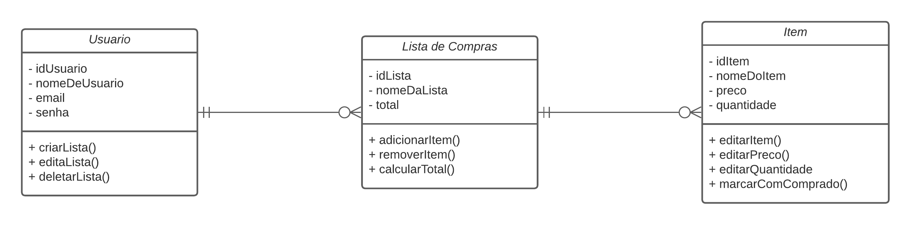
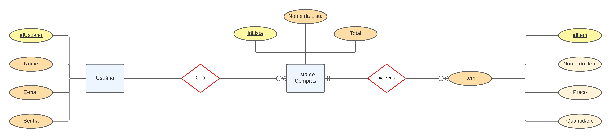

# Arquitetura da Solução

Pré-requisitos: <a href="3-Projeto de Interface.md"> Projeto de Interface</a>

Definição de como o software é estruturado em termos dos componentes que fazem parte da solução e do ambiente de hospedagem da aplicação.

## Diagrama de Classes

O diagrama de classes ilustra graficamente como será a estrutura do software, e como cada uma das classes da sua estrutura estarão interligadas. Essas classes servem de modelo para materializar os objetos que executarão na memória.

## Modelo ER

O Modelo ER representa através de um diagrama como as entidades (coisas, objetos) se relacionam entre si na aplicação interativa.

## Esquema Relacional

O Esquema Relacional corresponde à representação dos dados em tabelas juntamente com as restrições de integridade e chave primária.

## Modelo Físico

Entregar um arquivo banco.sql contendo os scripts de criação das tabelas do banco de dados. Este arquivo deverá ser incluído dentro da pasta src\bd.

## Tecnologias Utilizadas

- Linguagem: JavaScript
- Biblioteca: React Native
- IDE: Visual Studio Code
- Ferramenta Wireframes: Figma
- Ferramenta de Comunicação: Whatsapp e Discord
- Ferramenta de Gestão de Projeto: Github Projects
- Sistema de Gerenciamento de Banco de Dados: MySQL

## Hospedagem

Explique como a hospedagem e o lançamento da plataforma foi feita.

> **Links Úteis**:
>
> - [Website com GitHub Pages](https://pages.github.com/)
> - [Programação colaborativa com Repl.it](https://repl.it/)
> - [Getting Started with Heroku](https://devcenter.heroku.com/start)
> - [Publicando Seu Site No Heroku](http://pythonclub.com.br/publicando-seu-hello-world-no-heroku.html)

## Qualidade de Software

| **Subcaracterísticas de Qualidade de Software** | **Justificativa**                                                                                                                         | **Métrica**                                                                                                  |
| ----------------------------------------------- | ----------------------------------------------------------------------------------------------------------------------------------------- | ------------------------------------------------------------------------------------------------------------ |
| Adequação funcional                             | O software deve oferecer todas as funcionalidades necessárias para atender aos requisitos do cliente.                                     | Todas as funcionalidades especificadas no requisito foram implementadas corretamente?                        |
| Capacidade de recuperação                       | A capacidade de recuperação garante que o software possa se recuperar de falhas ou interrupções e retomar suas operações normalmente.     | Quanto tempo leva para o software se recuperar de uma falha e voltar à operação normal?                      |
| Facilidade de aprendizado                       | A facilidade de aprendizado torna o software mais acessível e reduz a curva de aprendizado para os usuários novatos.                      | Os usuários podem aprender a usar o software rapidamente, com pouca orientação adicional?                    |
| Tempo de resposta                               | O tempo de resposta rápido é crucial para garantir uma experiência de usuário fluida e responsiva, especialmente em sistemas interativos. | Qual é o tempo médio de resposta do sistema para as interações do usuário?                                   |
| Estabilidade de modificação                     | A capacidade de realizar alterações sem introduzir erros adicionais é essencial para a manutenção contínua do software.                   | Com que frequência as modificações introduzem novos bugs ou problemas no software?                           |
| Adaptabilidade                                  | A capacidade do software de ser adaptado para diferentes ambientes ou plataformas é essencial para sua utilização em diversas situações.  | O software pode ser facilmente configurado e ajustado para funcionar em diferentes ambientes ou plataformas? |
| Autenticação                                    | A autenticação é essencial para garantir que apenas usuários autorizados tenham acesso ao sistema, protegendo dados confidenciais.        | O sistema requer autenticação para acessar recursos protegidos?                                              |
| Capacidade de tolerância a falhas               | A capacidade de tolerância a falhas permite que o software continue funcionando adequadamente mesmo na presença de falhas ou erros.       | Como o software lida com falhas inesperadas e continua operando de forma confiável?                          |		
