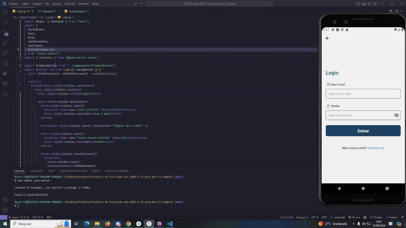
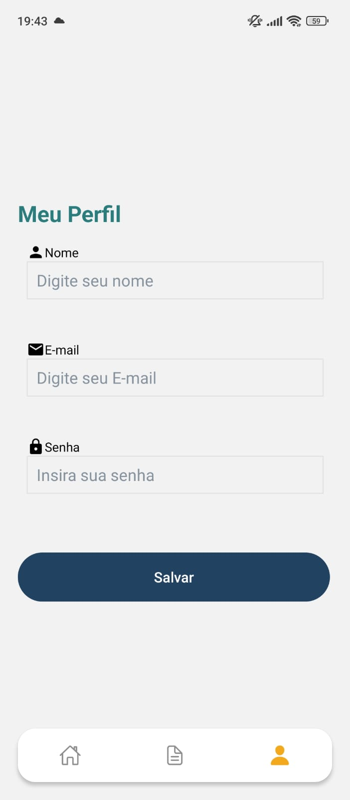
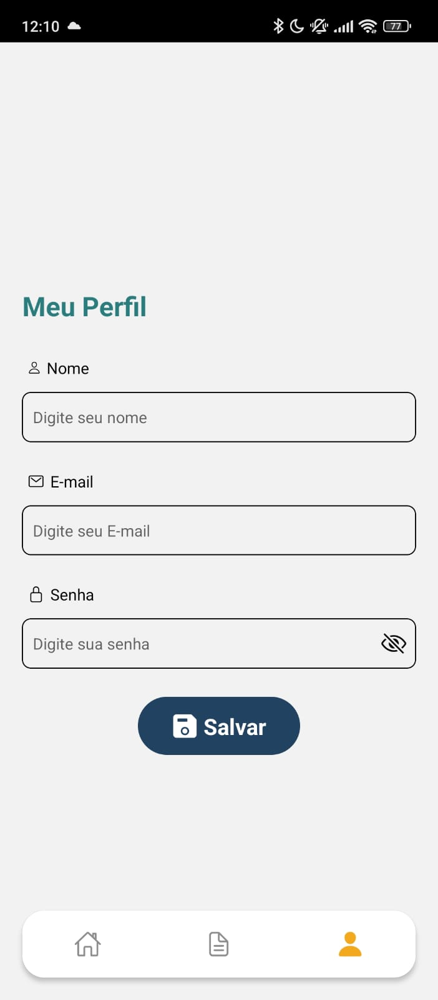

# Tela Onboarding

Desenvolvido por Philippe Ribeiro Mesquita, a tela onboarding é a primeira tela do app Compraí. Esta tela contém um botão call-to-action que redireciona os usuários para a tela de login. Foi criado no ambiente expo, conforme o primeiro módulo do Microfundamento de Desenvolvimento Mobile. Até o momento não tive dificuldades na criação de telas.

### ToDo:

- [x] Integrar a função do botão "Vamos Começar" à tela de login

Para a entrega da etapa 3, realizei a estilização da tela de Onboarding e implementei a funcionalidade do botão ‘Vamos Começar’ para a tela de Login. Além disso, fiz a integração da navegação entre as páginas.

https://github.com/ICEI-PUC-Minas-PMV-ADS/pmv-ads-2024-1-e3-proj-mov-t1-comprai/assets/97925429/d0d774bf-4754-41da-adf0-c4ac0ad44dc1

Para a conclusão da etapa 4, realizei a implementação completa da navegação do aplicativo, incluindo a navegação por pilha (stack navigation) e a navegação por abas (tab navigation) entre as diversas telas. Além disso, efetuei a estilização de várias telas para que correspondessem ao layout originalmente projetado. As telas que receberam essa estilização incluem ‘Profile’, ‘MyLists’, ‘Lists’, além de uma correção (FIX) implementada no botão de retorno das telas ‘Login’ e ‘CreateAccount’. No que diz respeito às dificuldades encontradas, enfrentei alguns desafios ao trabalhar com o json-server e json-server-auth. Isso ocorreu principalmente porque as aulas ministradas pelo professor estavam desatualizadas.

https://github.com/ICEI-PUC-Minas-PMV-ADS/pmv-ads-2024-1-e3-proj-mov-t1-comprai/assets/97925429/c12584e8-a656-4b61-a122-e3c7584ae156

# Tela de Login

Sendo desenvolvida por Mahavishnu Jneesh Afonso.

Tela Login do app junto ao botão que leva a tela Home, criado no
ambiente expo, conforme o primeiro modulo do Microfundamento de Desenvolvimento Mobile. Dificuldade leve ao integrar rotas de uma página pra outra.

Todo:

[x] Adicionar rota no botão fazendo levar pra tela home
[X] Adicionar banco e autenticação do usuario

 

Implementei uma tela de login com estilos os estilos do Figma, além de uma solução de roteamento que direciona os usuários para a tela inicial de forma eficaz. Agora, minha próxima etapa é resolver o processo de autenticação, que envolve a leitura de dados da API do servidor JSON.

 

 

implementei nesta etapa ao sistema de login e registro de usuario de nossa aplicação a parte de salvar os dados na API por meio de operações de Create e Read junto a parte logica para mandar estes dados para a Fake API. Utilizei dos recursos da azure disponibilizados e hospedei a nossa Fake API de forma a se ter um melhor acesso e gerenciamento do desenvolvimento. Realizei em conjunto a construção de parte do context salvando parte dos dados do ususario localmente para se usar posteriormente em conjunto a refinamentos e componentização de partes da tela. Mais informações conforme video/gif a seguir.

 

# Tela de Lista de compra

Sendo desenvolvida por Ercules Mauricio de Siqueira Filho.

- Tela Lista de compra do app apenas com o título da pagina.
  

- Evolução na estilização da tela.
  

- Evolução nas funcionalidades da tela: lista apresentada dinamicamente, adição e persistência de novos itens, soma do valor dos itens e opção de marcar ou desmarcar itens escolhidos.
  

# Tela de Listas Criadas

Sendo desenvolvida por Pedro Henrique Filgueiras Couto.
Atualização Etapa 4
Foram atualizados os botões e os visuais da tela.
### Todo:

[ ] Implementar a regra de visualização do json passada pelo time utilizando get.
[ ] Enviar informações do botão da lista selecionada para a tela Lists.

 

# Tela de Perfil do Usuario

Sendo desenvolvido por João Gabriel.

Tela de perfil do usuário. Foram desenvolvido as partes de inserir nome, o e-mail e a senha.
Não consegui criar uma funcionalidade de mostrar a senha, o botão ''salvar'' não está funcional.

Estilização atualizada de acordo com o padrão do Figma. Falta deixar a tela responsiva.

# Tela de Cadastro de Usuario

Sendo desenvolvida por Rafael Santana de Oliveira

Tela de cadastro de novos usuarios, sendo composta por 3 inputs nome, email e senha, e contendo um botão para realizar o envio do
cadastro do usuario.Caso o usuario já tenha se registrando dentro do app e possivel ir para a tela de login pelo link abaixo do
botão de "Cadastrar".

# Tela Home

Sendo desenvolvida por Allan Cesar Amaral Gomes

Tela Home do aplicativo Compraí, consiste na página principal da aplicação. A página deve conter um botão acessível indicando a criação de uma nova lista, além das opções para alternar entre as abas Página Principal(Home), Minhas Listas e Perfil.

OBS: Recebeu atualizações em interface com inserção de estilos para a etapa 3.

- Atualizações Etapa 4

**Tela Home**
Tela desenvolvida para o projeto principal do eixo.

**Tela Home com CRUD**
Tela solicitada pelo orientador da etapa. (Foi feita em em outra Branch para não interferir a tela Home pincipal do projeto. A mesma não será utilizada no projeto por não ter compatibilidade com arquitetura do projeto estabelecido)

