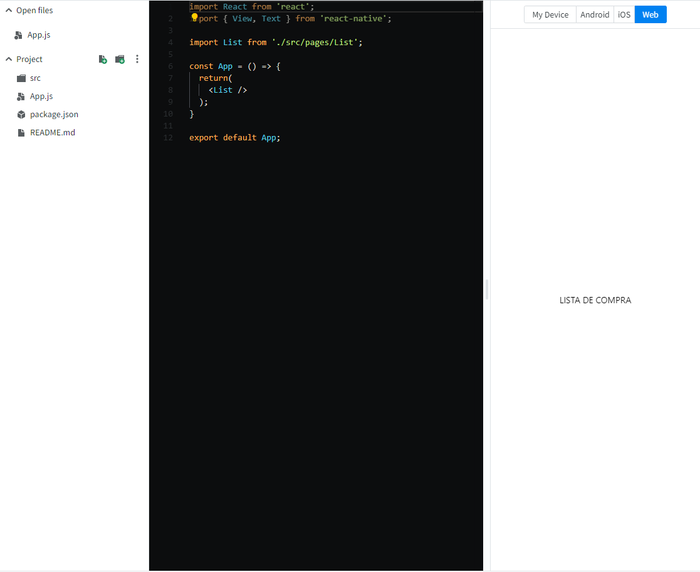
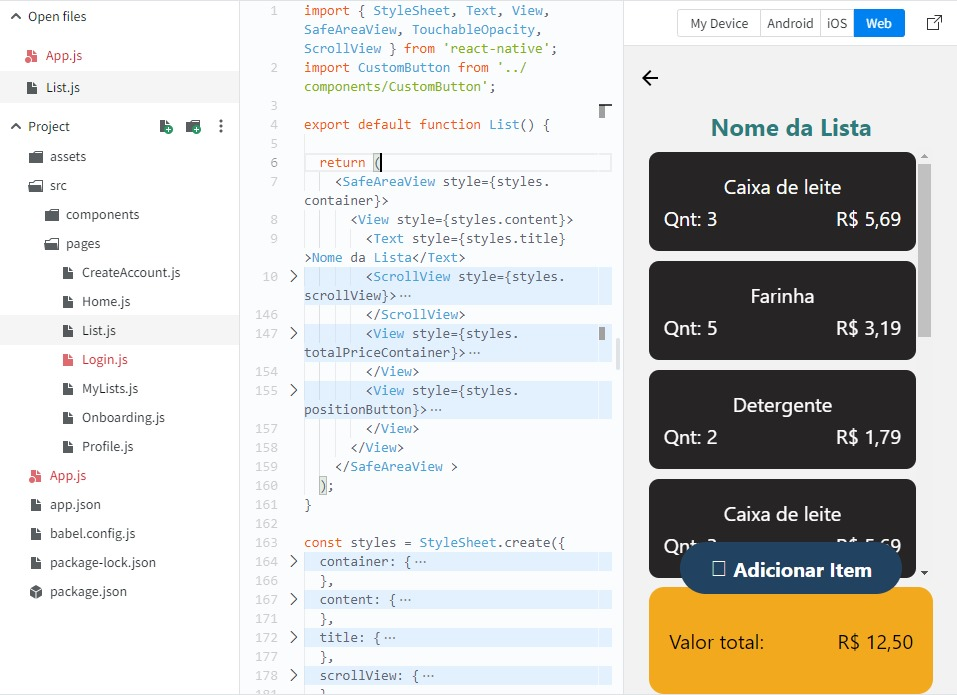
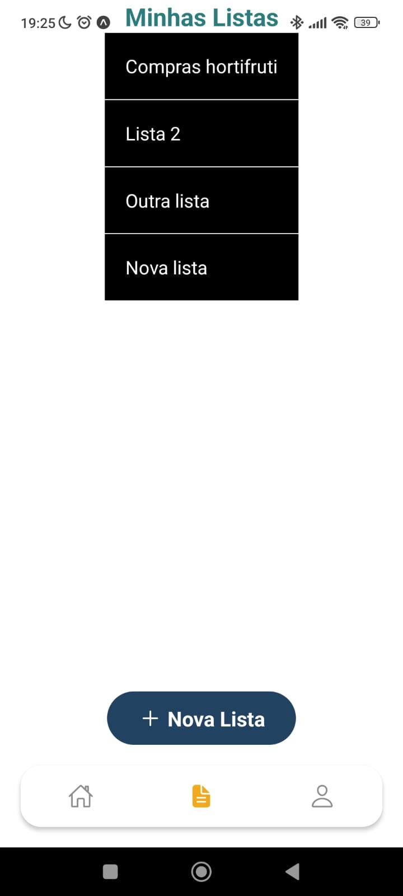
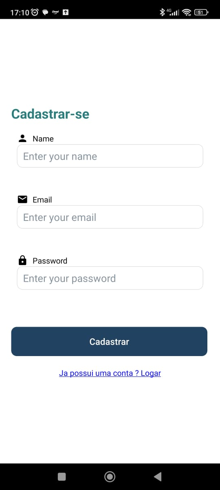
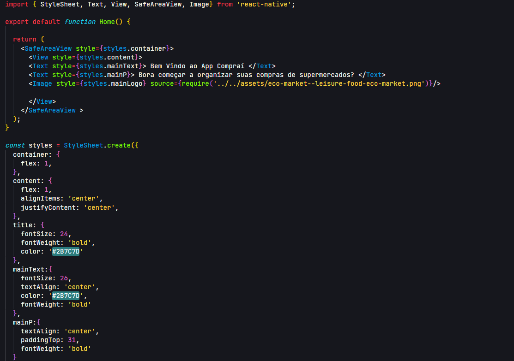

# Tela Onboarding

Desenvolvido por Philippe Ribeiro Mesquita, a tela onboarding é a primeira tela do app Compraí. Esta tela contém um botão call-to-action que redireciona os usuários para a tela de login. Foi criado no ambiente expo, conforme o primeiro módulo do Microfundamento de Desenvolvimento Mobile. Até o momento não tive dificuldades na criação de telas.

### ToDo:

- [x] Integrar a função do botão "Vamos Começar" à tela de login

Para a entrega da etapa 3, realizei a estilização da tela de Onboarding e implementei a funcionalidade do botão ‘Vamos Começar’ para a tela de Login. Além disso, fiz a integração da navegação entre as páginas.

https://github.com/ICEI-PUC-Minas-PMV-ADS/pmv-ads-2024-1-e3-proj-mov-t1-comprai/assets/97925429/d0d774bf-4754-41da-adf0-c4ac0ad44dc1

# Tela de Login

Sendo desenvolvida por Mahavishnu Jneesh Afonso.

Tela Login do app junto ao botão que leva a tela Home, criado no
ambiente expo, conforme o primeiro modulo do Microfundamento de Desenvolvimento Mobile. Dificuldade leve ao integrar rotas de uma página pra outra.

Todo:

[x] Adicionar rota no botão fazendo levar pra tela home
[ ] Adicionar banco e autenticação do usuario

Implementei uma tela de login com estilos os estilos do Figma, além de uma solução de roteamento que direciona os usuários para a tela inicial de forma eficaz. Agora, minha próxima etapa é resolver o processo de autenticação, que envolve a leitura de dados da API do servidor JSON.

<viideo  width="320" height="240" controls> 
<source src="../docs/img/funcionalidadeLogin.mp4" type="video/mp4">
Your browser does not support the video tag.
</video>

# Tela de Lista de compra

Sendo desenvolvida por Ercules Mauricio de Siqueira Filho.

- Tela Lista de compra do app apenas com o título da pagina.
  

- Evolução na estilização da tela.
  

# Tela de Listas Criadas

Sendo desenvolvida por Pedro Henrique Filgueiras Couto.
Atualização etapa 3 programação de uma funcionalidade de leitura de arquivo json e apresentação em tela do Nome das listas.
Ao clicar em cada lista o botão derruba o sistema pois a lógica de abertura de listas ainda não foi implementada.

### Todo:

[ ] Fazer com que a lista seja demonstrada ao clicar no registro selecionado.

 

# Profile

Sendo desenvolvido por João Gabriel.
Tela de perfil do usuário.

# Tela de Cadastro de Usuario

Sendo desenvolvida por Rafael Santana de Oliveira

Tela de cadastro de novos usuarios, sendo composta por 3 inputs nome, email e senha, e contendo um botão para realizar o envio do
cadastro do usuario.Caso o usuario já tenha se registrando dentro do app e possivel ir para a tela de login pelo link abaixo do
botão de "Cadastrar".

# Tela Home

Sendo desenvolvida por Allan Cesar Amaral Gomes

Tela Home do aplicativo Compraí, consiste na página principal da aplicação. A página deve conter um botão acessível indicando a criação de uma nova lista, além das opções para alternar entre as abas Página Principal(Home), Minhas Listas e Perfil.

OBS: Recebeu atualizações em interface com inserção de estilos para a etapa 3.

