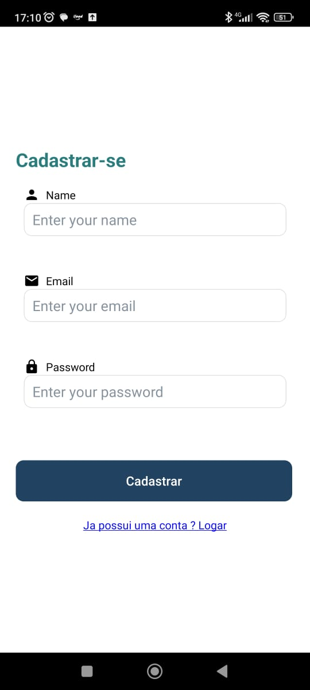

# Programação de Funcionalidades

Pré-requisitos: <a href="2-Especificação do Projeto.md"> Especificação do Projeto</a>, <a href="3-Projeto de Interface.md"> Projeto de Interface</a>, <a href="4-Metodologia.md"> Metodologia</a>, <a href="3-Projeto de Interface.md"> Projeto de Interface</a>, <a href="5-Arquitetura da Solução.md"> Arquitetura da Solução</a>

Implementação do sistema descritas por meio dos requisitos funcionais e/ou não funcionais. Deve relacionar os requisitos atendidos os artefatos criados (código fonte) além das estruturas de dados utilizadas e as instruções para acesso e verificação da implementação que deve estar funcional no ambiente de hospedagem.

Para cada requisito funcional, pode ser entregue um artefato desse tipo

> **Links Úteis**:
>
> - [Trabalhando com HTML5 Local Storage e JSON](https://www.devmedia.com.br/trabalhando-com-html5-local-storage-e-json/29045)
> - [JSON Tutorial](https://www.w3resource.com/JSON)
> - [JSON Data Set Sample](https://opensource.adobe.com/Spry/samples/data_region/JSONDataSetSample.html)
> - [JSON - Introduction (W3Schools)](https://www.w3schools.com/js/js_json_intro.asp)
> - [JSON Tutorial (TutorialsPoint)](https://www.tutorialspoint.com/json/index.htm)

# Tela Onboarding

Desenvolvido por Philippe Ribeiro Mesquita, a tela onboarding é a primeira tela do app Compraí. Esta tela contém um botão call-to-action que redireciona os usuários para a tela de login. Foi criado no ambiente expo, conforme o primeiro módulo do Microfundamento de Desenvolvimento Mobile. Até o momento não tive dificuldades na criação de telas.

### ToDo:

- [x] Integrar a função do botão "Vamos Começar" à tela de login

Para a entrega da etapa 3, realizei a estilização da tela de Onboarding e implementei a funcionalidade do botão ‘Vamos Começar’ para a tela de Login. Além disso, fiz a integração da navegação entre as páginas.

<video src="../docs/img/video-projeto-etapa-3.mp4">

# Tela de Login
Sendo desenvolvida por Mahavishnu Jneesh Afonso.

Tela Login do app junto ao botão que leva a tela Home, criado no 
ambiente expo, conforme o primeiro modulo do Microfundamento de Desenvolvimento Mobile. Dificuldade leve ao integrar rotas de uma página pra outra.

Todo: 

[ ] Adicionar rota no botão fazendo levar pra tela home

# Tela de Lista de compra
Sendo desenvolvida por Ercules Mauricio de Siqueira Filho. 
Tela Lista de compra do app apenas com o título da pagina, criado no ambiente expo, conforme o primeiro modulo do Microfundamento de Desenvolvimento Mobile.

# Tela de Listas Criadas
Sendo desenvolvida por Pedro Henrique Filgueiras Couto.
Atualização etapa 3 programação de uma funcionalidade de leitura de arquivo json e apresentação em tela do Nome das listas.
Ao clicar em cada lista o botão derruba o sistema pois a lógica de abertura de listas ainda não foi implementada.

### Todo: 

[ ] Fazer com que a lista seja demonstrada ao clicar no registro selecionado.

 

 

# Profile 
  
  Sendo desenvolvido por João Gabriel.
  Tela de perfil do usuário.

# Tela de Cadastro de Usuario
Sendo desenvolvida por Rafael Santana de Oliveira

Tela de cadastro de novos usuarios, sendo composta por 3 inputs nome, email e senha, e contendo um botão para realizar o envio do
cadastro do usuario.Caso o usuario já tenha se registrando dentro do app e possivel ir para a tela de login pelo link abaixo do 
botão de "Cadastrar".

# Tela Home
Sendo desenvolvida por Allan Cesar Amaral Gomes

Tela Home do aplicativo Compraí, consiste na página principal da aplicação. A página deve conter um botão acessível indicando a criação de uma nova lista, além das opções para alternar entre as abas Página Principal(Home), Minhas Listas e Perfil.

OBS: Recebeu atualizações em interface com inserção de estilos para a etapa 3.

